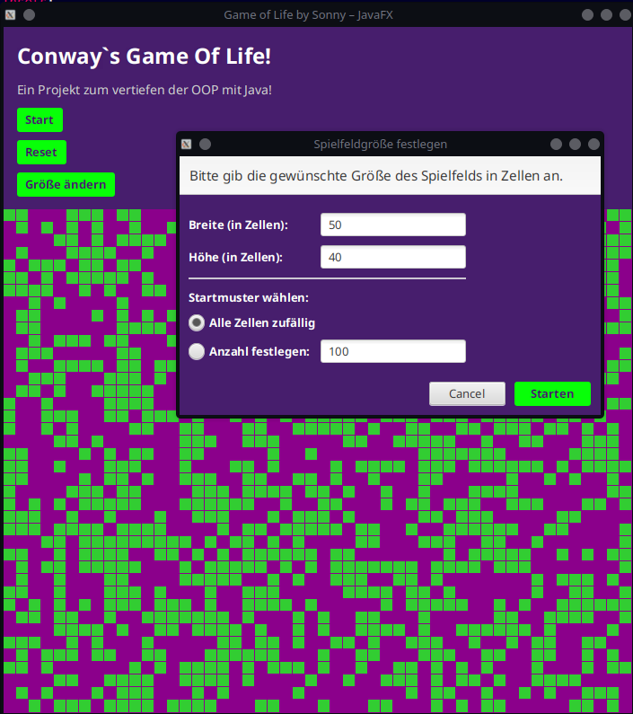

# Game of Life (Java, JavaFX)

**Autor:** [Blockchainnewbie](https://github.com/Blockchainnewbie)  
**Sprache:** Java (100%)  
**GUI:** JavaFX  

---

## Inhalt

- [Über das Projekt](#über-das-projekt)
- [Features](#features)
- [Installation & Start](#installation--start)
- [Benutzung](#benutzung)
- [Codequalität](#codequalität)
- [Mitwirken](#mitwirken)
- [Lizenz](#lizenz)

---



## Über das Projekt

Dieses Projekt ist eine moderne, objektorientierte Implementierung von Conway's Game of Life in Java mit einer grafischen Oberfläche auf Basis von JavaFX.  
Der Fokus liegt auf SOLID-Prinzipien, Clean-Code und ausführlicher Dokumentation für bestmögliche Wartbarkeit und Erweiterbarkeit.

## Features

- Intuitive JavaFX-Benutzeroberfläche
- Dynamische Anpassung der Spielfeldgröße
- Start-, Pause- und Reset-Funktionalität
- Saubere Architektur nach SOLID und Clean-Code-Prinzipien
- Gut dokumentierter Quellcode mit Docstrings

## Installation & Start

1. **Voraussetzungen**
   - Java 17+

2. **Klonen**
   ```bash
   git clone https://github.com/Blockchainnewbie/game_of_life.git
   cd game_of_life
   ```

3. **Starten**
   - Öffne das Projekt in deiner bevorzugten Java-IDE (z.B. IntelliJ IDEA, Eclipse, VS Code)
   - Führe die Hauptklasse `GameOfLifeFX.java` aus

## Benutzung

- Mit der GUI können Zellen gesetzt und entfernt werden.
- Über die Steuerelemente lässt sich das Spiel starten, pausieren und zurücksetzen.

## Codequalität

- **SOLID:** Strikte Einhaltung der SOLID-Prinzipien für Wartbarkeit und Erweiterbarkeit
- **Clean-Code:** Konsistente Benennung, keine "Magic Numbers", klare Methoden- und Klassenstruktur
- **Docstrings:** Alle öffentlichen Klassen und Methoden sind dokumentiert

## Mitwirken

Pull Requests und Issues sind willkommen!  
Bitte achte auf:
- Einhaltung von Clean-Code und SOLID
- Sinnvolle Commit-Messages

## Lizenz

Dieses Projekt steht unter der MIT-Lizenz. Siehe [LICENSE](LICENSE) für Details.

---

**Viel Spaß beim Erkunden, Testen und Weiterentwickeln!**
```

Wenn du weitere Anforderungen oder Wünsche hast, teile sie gerne mit!

