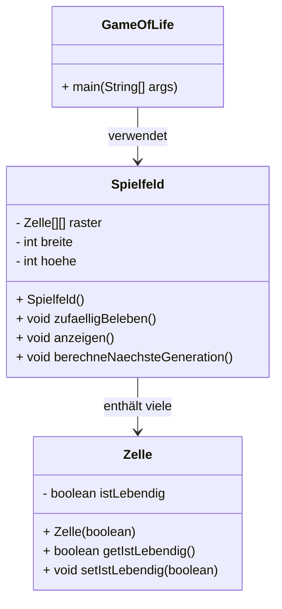
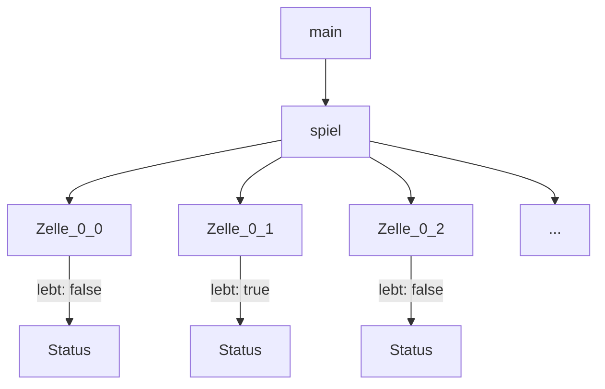

# 📘 Game of Life – OOP-Diagramme (Klassendiagramm & Objektdiagramm)

## 🧱 Klassendiagramm (UML)

```mermaid
classDiagram
    class Zelle {
        - boolean istLebendig
        + Zelle(boolean)
        + boolean getIstLebendig()
        + void setIstLebendig(boolean)
    }

    class Spielfeld {
        - Zelle[][] raster
        - int breite
        - int hoehe
        + Spielfeld()
        + void zufaelligBeleben()
        + void anzeigen()
        + void berechneNaechsteGeneration()
    }

    class GameOfLife {
        + main(String[] args)
    }

    GameOfLife --> Spielfeld : verwendet
    Spielfeld --> Zelle : enthält viele
```

---

## 🧠 Objektdiagramm (Laufzeit)

```mermaid
graph TD
    A[main] --> B[spiel]
    B --> C[Zelle_0_0]
    B --> D[Zelle_0_1]
    B --> E[Zelle_0_2]
    B --> F[...]
    C -->|lebt: false| F1[Status]
    D -->|lebt: true| F2[Status]
    E -->|lebt: false| F3[Status]

```

---

